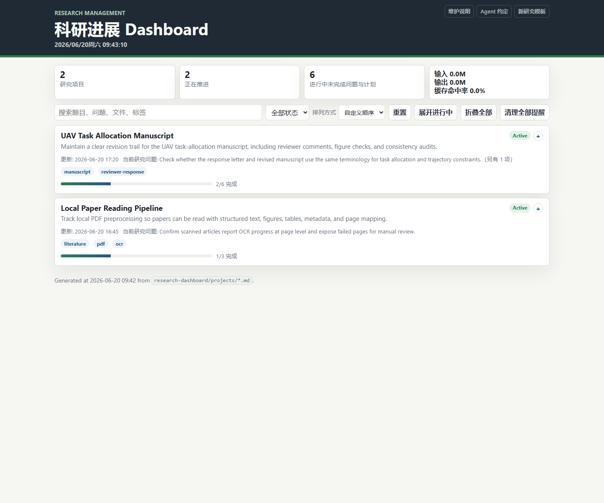
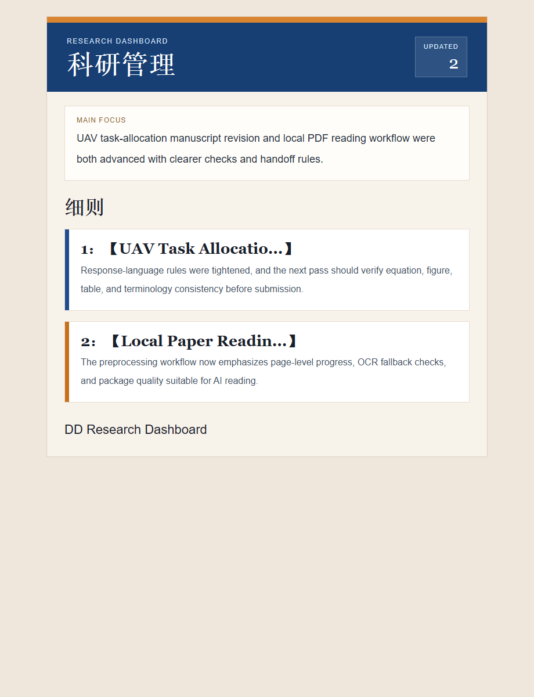

# DD Research Dashboard Daily

A portable Codex research-dashboard scaffold with a daily email-report workflow.

This repository packages:

- a `maintain-research-dashboard` Codex skill;
- a local Markdown-based research dashboard scaffold;
- project templates and dashboard build tools;
- a daily research-report guide;
- SMTP email sender tooling with local encrypted secret storage;
- a reusable Codex automation prompt template;
- a PowerShell installer for Windows.

The package is designed for another Codex agent to read and deploy on a local Windows machine.

## Preview

Dashboard interface:



Daily email preview:



## What This Repository Does Not Include

This public repository intentionally excludes:

- real dashboard project history;
- generated dashboard HTML/data from a private workspace;
- daily report history;
- SMTP secrets or real sender account config;
- Codex automation ids or target thread ids;
- token usage summary JSON;
- account caches, login data, browser profiles, PDFs, or private research files.

## Quick Install

From PowerShell:

```powershell
git clone https://github.com/dynamics-pilot/dd-research-dashboard-daily.git
cd dd-research-dashboard-daily
.\install_dashboard_daily.ps1 -ResearchRoot "D:\ResearchManagement"
```

If Codex home is not the default user profile path:

```powershell
.\install_dashboard_daily.ps1 -CodexHome "D:\path\to\.codex" -ResearchRoot "D:\ResearchManagement"
```

Then read:

```text
AGENT_HANDOFF.md
```

## Basic Workflow

1. Install the dashboard scaffold and skill.
2. Create a first project from `research-dashboard/projects/_template.md`.
3. Run `python .\research-dashboard\tools\build_dashboard.py`.
4. Configure `research-dashboard/config/smtp-mail.local.json`.
5. Create the SMTP secret locally with `set_smtp_secret.py`.
6. Test `send_dashboard_email_smtp.py --date YYYY-MM-DD`.
7. Create a local Codex daily automation using `automation-template/daily-report-automation.md`.

## Encoding

All Markdown and JSON files should be read and written as UTF-8. Prefer UTF-8 without BOM for generated files. When printing Windows paths in chat, wrap them in backticks or fenced code blocks so backslashes are not lost.

## License

This project is released under the MIT License.

Copyright (c) 2026 Diwei Cheng

See `SECURITY.md` before publishing any fork with local data.
